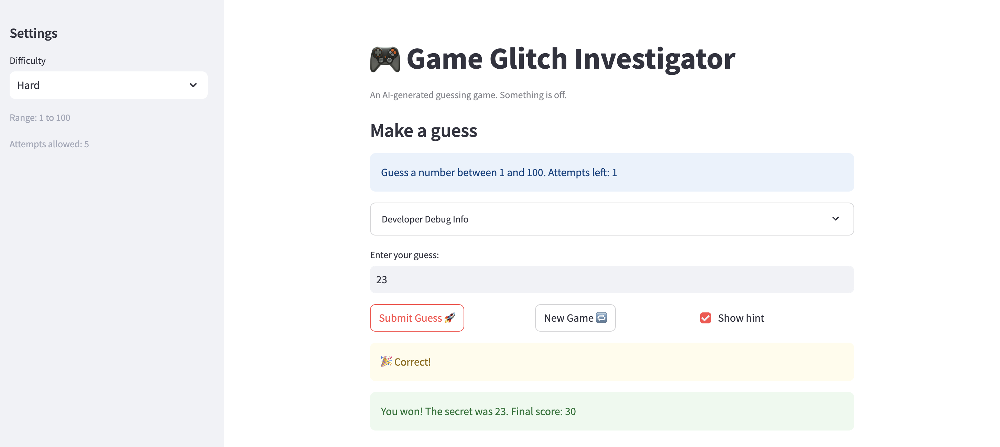

# 🎮 Game Glitch Investigator: The Impossible Guesser

## 🚨 The Situation

You asked an AI to build a simple "Number Guessing Game" using Streamlit.
It wrote the code, ran away, and now the game is unplayable. 

- You can't win.
- The hints lie to you.
- The secret number seems to have commitment issues.

## 🛠️ Setup

1. Install dependencies: `pip install -r requirements.txt`
2. Run the broken app: `python -m streamlit run app.py`

## 🕵️‍♂️ Your Mission

1. **Play the game.** Open the "Developer Debug Info" tab in the app to see the secret number. Try to win.
2. **Find the State Bug.** Why does the secret number change every time you click "Submit"? Ask ChatGPT: *"How do I keep a variable from resetting in Streamlit when I click a button?"*
3. **Fix the Logic.** The hints ("Higher/Lower") are wrong. Fix them.
4. **Refactor & Test.** - Move the logic into `logic_utils.py`.
   - Run `pytest` in your terminal.
   - Keep fixing until all tests pass!

## 📝 Document Your Experience

**Purpose:** A number guessing game where the player guesses a secret number within a difficulty-based range and attempt limit, earning points for faster wins.

**Bugs found and fixed:**

- **Wrong hints**: `check_guess` had "Go HIGHER!" and "Go LOWER!" swapped, giving the opposite direction every guess.
- **String comparison glitch**: On even attempts, `secret` was cast to a string before comparison. This caused lexicographic comparison (e.g. `"9" > "50"` is `True`), producing wrong hints and making the game unwinnable half the time.
- **Out-of-range inputs accepted**: No validation checked whether the guess was within the difficulty range. Added a bounds check that rejects guesses outside `[low, high]` without costing an attempt.
- **Attempts counter off-by-one**: `attempts` started at `1` instead of `0`, so the "attempts left" display was always one short and the attempt limit was effectively one fewer than configured.
- **Win scoring off-by-one**: Score calculation used `100 - 10 * (attempt_number + 1)` instead of `100 - 10 * attempt_number`, under-rewarding every win.
- **"Too High" rewarded wrong guesses**: Every even attempt with a "Too High" result added `+5` points instead of deducting them.
- **New Game button broken**: Reset `attempts` to `0` (now fixed to match init), used hardcoded `random.randint(1, 100)` ignoring difficulty, and never cleared `score`, `status`, or `history`.
- **Refactoring**: Moved all logic functions (`get_range_for_difficulty`, `parse_guess`, `check_guess`, `update_score`) from `app.py` into `logic_utils.py` and imported them.

## 📸 Demo

 

## 🚀 Stretch Features

- [ ] [If you choose to complete Challenge 4, insert a screenshot of your Enhanced Game UI here]
